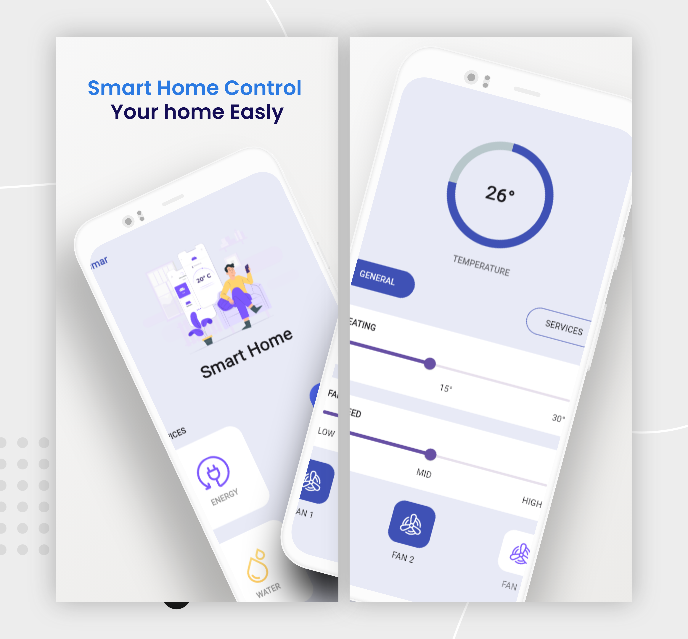

# Smart Home Control

That app was part of a smart home control system that can control everything in the
home, including lights and fans. A/C sound system RGB light colours All of these things
are managed by this app with voice command control using speech-to-text technology.
The whole project is controlled by Firebase Firestore, and the user can configure or
add a new item of control with this app and have email, Google, and Facebook logins.

Star ⭐ the repo if you like what you see😉.

#### How to Install?
```
git clone https://github.com/omarabdullah1/smart_home_control.git
cd smart_home_control
flutter packages get
flutter run
```
#### Looks

